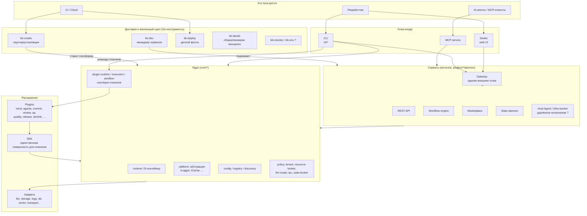

# KB Labs — System Overview (top level, DRAFT)

> **Status:** DRAFT v0 — собрано из структуры репозитория, `docs/adr/` и README, автором не проверено.
> Пометка `?` = моя догадка, нужна правка владельца. Уровень: только «кто за что отвечает», без деталей.
> Следующие уровни (C2 по каждой области, потоки, инварианты) — после утверждения этого.

## 1. Что это

KB Labs — платформа для разработчика: CLI + сервисы + плагины + Studio, которая работает поверх любых
проектов пользователя (mind/поиск по коду, агенты, commit/review/qa/release, workflow и т.д.).

## 2. Крупные блоки

Правило направления зависимостей (из `AGENTS.md`): `core` → `sdk`/`shared`/`core/plugin-*` → `cli`/`adapters` → `plugins` → `studio`.

## 3. Блоки и ответственность

| Блок | Где | За что отвечает | Статус понимания |
|---|---|---|---|
| **Core** | `core/` | DI-runtime, абстракции платформы (`core-platform`), конфиг, реестр/discovery, политики, tenant, ресурсы, llm-router, IPC, изоляция плагинов (sandbox, plugin-runtime/execution) | из README/ADR |
| **SDK** | `sdk/sdk`, `sdk/platform-client` | Единственная поверхность плагина к платформе (`ctx.platform` — узкий `IPluginAdapters`, ADR-0021). `platform-client` — zero-dep клиент для внешних продуктов | ADR-0021 |
| **Adapters** | `adapters/` | Реализации портов: LLM (openai, voyage, vibeproxy), хранилища (fs, s3, sqlite, mongodb, redis, qdrant), логи (pino, ringbuffer), аналитика, транспорт, notifier, docker-environment, workspace-agent | по именам |
| **CLI** | `cli/` (bin, commands, contracts, runtime) | Разбор команд, маршрутизация в плагины, presenters, транспорт до gateway/host-agent | README |
| **Shared** | `shared/` | Общие библиотеки: cli-ui, command-kit, daemon, http, tool-kit, testing | по именам |
| **Services** | `services/gateway,mcp,rest-api` + `plugins/{workflow,marketplace,state}/daemon` | Долгоживущие процессы: Gateway (единый внешний порт, ADR-0020), REST, MCP, Workflow, Marketplace, State daemon | `.kb/devservices.yaml` |
| **Plugins** | `plugins/*` | Продуктовая функциональность поверх SDK (список ниже) | см. §4 |
| **Studio** | `studio/*` | Web UI: app, ui-kit/ui-core, data-client, federation (плагинные страницы), event-bus | по именам |
| **Marketplace** | `plugins/marketplace`, `marketplace-registry/` | Установка/включение сущностей (плагины, адаптеры…) через lock-файл; реестр опубликованных пакетов | ADR-0012/0026 |
| **kb-create** | `tools/kb-create` (Go) | Единственный лаунчер: `plan/apply/update/uninstall/rollback/doctor/wizard` по релиз-индексу; ставит платформу и рендерит `kb.config` + `devservices` | README, ADR-0027/0035 |
| **kb-dev** | `tools/kb-dev` (Go) | Локальный менеджер сервисов: процессы, health-пробы, порядок старта, watchdog | README |
| **kb-deploy** | `tools/kb-deploy` (Go) | Деплой на флот; мигрирует к контейнерам как каноническому пути (ADR-0037) | ADR-0014/0037 |
| **kb-devkit** | `tools/kb-devkit`, `infra/devkit` | Сборка в порядке зависимостей, проверки/дрифт, sync шаблонов конфигов монорепо | AGENTS.md |
| **Release** | `plugins/release`, ADR-0041/0042 | Control plane релиза = workflow-движок; GitHub Actions = плоскость исполнения артефактов | ADR-0042 |
| **Delivery/infra** | `deploy/`, `infra/`, `templates/`, `e2e/` | Docker/Helm, шаблоны (плагин, продукт, Go-бинарь), e2e-зоны | по именам |
| **Sites** | `sites/web` | Публичный сайт | по имени |

## 4. Плагины (первый заход)

| Плагин | Назначение (догадка по имени) |
|---|---|
| `mind` | семантический поиск/RAG по коду (`kb mind ask`) |
| `agents` | рантайм агентов (kernel, tools, tracing, mcp, store) |
| `commit`, `review`, `qa`, `quality` | коммиты, ревью, QA, проверки качества |
| `release` | планирование и проведение релизов |
| `workflow` | движок/демон воркфлоу (одновременно и сервис) |
| `marketplace`, `marketplace-registry` | управление и реестр сущностей |
| `state` | state-daemon |
| `gateway`, `rest-api`, `host-agent`, `infra-worker` | сервисы, оформленные как плагины ? |
| `devlink`, `impact`, `inbox`, `steward`, `policy`, `scaffold` | ? нужны твои определения |
| `clickup`, `github`, `site-tools` | интеграции/инструменты ? |

## 5. Ключевые сквозные идеи (уже зафиксированы в ADR)

- **Два скоупа: platform root и project root** (ADR-0012): платформа ставится в `~/kb-platform` (или `KB_PLATFORM_ROOT`), проект держит `.kb/kb.config.*` и свой `marketplace.lock`; проект переопределяет платформу.
- **Плагин видит платформу только через узкую поверхность** (ADR-0021) — рантайм-фильтр есть, типы разделены.
- **Единый декларативный установщик** (ADR-0027/0028/0035): человек, агент и CI идут в один движок.
- **Релиз: engine = control plane, CI = delivery plane** (ADR-0042).

## 6. Вопросы к владельцу (нужны правки)

1. Верно ли разбиение на блоки? Что лишнее/недостающее на этом уровне?
2. Кто входит в «лаунчер»: только `kb-create`, или ещё что-то, что запускает платформу в повседневной работе (`kb-dev` + CLI)?
3. `gateway`, `rest-api`, `state`, `host-agent`, `infra-worker` — это сервисы или плагины? Сейчас они и то и другое (есть `services/*` и `plugins/*`).
4. Какие связи здесь «намеренные», а какие исторические (в `docs/ARCHITECTURE-BOUNDARIES.md` уже есть список нарушений: плагины → core в обход SDK, studio → plugin-contracts)?
5. Где должна жить граница «реестр проектов» из обсуждения целевой модели? Сейчас ближайший аналог — ADR-0012 (platform/project scope), но реестра нескольких проектов и Start/Stop в UI не видно.
