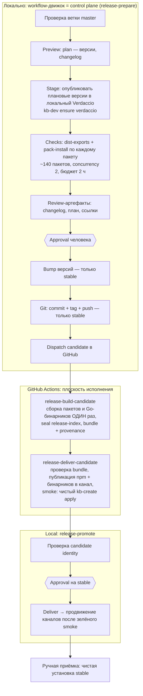

# 09 — Процесс релиза: схема, точки отказа и план (DRAFT v0)

> Собрано по коду и документам (2026-09): `docs/RELEASE-PROCESS.md`, ADR-0041/0042, `.kb/workflows/release-prepare.yml`, `release-promote.yml`,
> `plugins/release/manager-core/src/checks.ts`, `.kb/kb.config.jsonc` (`release.flows`), `tools/kb-create/v2/catalog/catalog.go`, реальный `release-index.json`.
> **Не проверялось:** сами GitHub-workflow (`release-build-candidate.yml`, `release-deliver-candidate.yml`) прочитаны только по описанию; ни один релиз не запускался.
> Правило: релизы — только с явного разрешения автора (`CLAUDE.md`); документ ничего не запускает.

## 1. Как работает релиз сегодня

**Потоки:** SDK (`sdk-vX.Y.Z`), платформа (`platform-vX.Y.Z`), бинарники (`vX.Y.Z-binaries`, входят в тот же candidate). Версионирование lockstep по flow.

**Артефакты релиза** (каталог `.kb/release/candidates/<candidate-id>/`): `release-index.json`, `bundle.sha256`, `provenance.json`, `binary-manifest.json`, `npm/`, `binaries/`.

**Release index** (`kb.create.release-index/v2`, запечатан digest): каналы, платформы (с профилем: список сервисов, порты, health-check, конфиг по умолчанию, бинарники по os/arch, члены платформы), sdks, плагины, адаптеры, **матрица совместимости** (`kb.release-compatibility/2`).

**Матрица совместимости:** метки `platform@X`, `sdk@Y`, `binary:kb-create@X:os/arch`; связи `requires` — точные пары, ничего не совместимо по умолчанию. `kb-create` проверяет в `CheckCompatibility` (`catalog.go`): есть ли метка платформы, связана ли она с выбранным SDK, связан ли бинарник и с платформой, и с SDK.

**Кто за что:** движок (`release-prepare`, плагин `release`) решает: план, проверки, approval, index; CI только строит и доставляет; `kb-create` только потребитель index (ADR-0041/0042).

## 2. Где ломается и почему непонятно (по коду)

| # | Симптом | Причина в коде |
|---|---|---|
| 1 | Видно только первый провал | `runReleaseChecks` останавливается на первой неуспешной проверке (`break`); чинишь одно и заново ждёшь часы |
| 2 | «Упало, а что делать?» | Итог — `error: "exit code N"` + сырой stderr; поле `hint` используется только для `optional`; нет классификации причин и рекомендаций |
| 3 | Внутри проверки виден один пакет | В верхнем результате `details = firstFailure`; остальные пакеты лежат в `packages[]`, но как их показывает CLI, не проверено |
| 4 | Провал из-за окружения выглядит как провал проверки | Checks зависят от Verdaccio (`kb-dev ensure verdaccio`, Docker, `net-offset`), сети и npm; нет предполётной проверки окружения |
| 5 | «Тихие» убийства по таймауту | Внутренняя квота CLI 30 мин против внешнего бюджета 2 ч (описано в комментарии workflow); таймаут проверки ретраится один раз, дальше — «Process terminated: timeout» |
| 6 | Медленно и недетерминированно | ~140 пакетов × реальные `npm pack` + `npm install`, concurrency 2, зависит от нагрузки, CPU, диска и реестра |
| 7 | Обход стал нормой | `skipChecks: true` в workflow «на случай сломанных checks»; повторный ручной прогон = три команды, описанные только в комментарии workflow |
| 8 | Два места сбоя | Локальный движок + GitHub-раннеры: логи, идентификаторы и состояния в разных местах; candidate лежит локально и не отслеживается git |
| 9 | Хрупкая публикация | Последние правки (#473, #475: E409 на dist-tag, повтор чтения) — признак нестабильных шагов публикации/продвижения |
| 10 | Грязная база | «Current release status» в approval предупреждает, что последний stable-тег и npm могут расходиться — релиз строится на неочищенной базе |
| 11 | Ошибки релиза не в общем формате | Не используется конверт/каталог ошибок из `08-errors` |

## 3. Целевой процесс

Принцип: **релиз — конечный автомат с именованными стадиями; на каждой стадии понятный контракт, причина провала, подсказка и команда продолжить.** Ничего не запускаем «вслепую» на часы.

### 3.1 Стадии и их контракт

| Стадия | Вход | Выход | Провалы (примеры кодов) |
|---|---|---|---|
| `preflight` (новая, секунды) | окружение | «релиз возможен» или список причин | `KB_RELEASE_BRANCH_NOT_MASTER`, `KB_RELEASE_TREE_DIRTY`, `KB_RELEASE_DOCKER_UNAVAILABLE`, `KB_RELEASE_REGISTRY_UNREACHABLE`, `KB_RELEASE_TOKEN_MISSING`, `KB_RELEASE_BASELINE_DRIFT` |
| `plan` | ветка, коммиты | план версий | `KB_RELEASE_PLAN_INVALID` |
| `stage` | план | плановые версии в Verdaccio | `KB_RELEASE_STAGING_FAILED` |
| `checks` | staged пакеты | отчёт по всем проверкам | `KB_RELEASE_CHECK_FAILED` (пакет, проверка, причина) |
| `review` / `approval` | отчёты | решение человека | — |
| `prepare` / `git` | решение | версии, тег | `KB_RELEASE_GIT_PUSH_REJECTED` |
| `candidate` (CI) | коммит | bundle + index + provenance | `KB_RELEASE_INDEX_SEAL_FAILED`, `KB_RELEASE_BUILD_FAILED` |
| `deliver` (CI) | bundle | опубликованные байты | `KB_RELEASE_REGISTRY_BINDING_FAILED` |
| `smoke` (CI) | публичный candidate | чистая установка работает | `KB_RELEASE_SMOKE_FAILED` |
| `promote` | зелёный smoke | каналы сдвинуты | `KB_RELEASE_PROMOTE_FAILED` |

Каждая ошибка — в конверте из `08-errors` (область `release`), с `hint` и командой продолжения.

### 3.2 Единый отчёт о прогоне (главное облегчение боли)

Один артефакт `release-run-report` на прогон (Markdown + JSON), одинаковый локально и в CI:
- таблица стадий: статус, длительность, ссылка на лог;
- для провала: **классификация** (окружение / содержимое пакета / инфраструктура CI / вероятная нестабильность), **корневая причина одной строкой**, `hint`, команда `kb release resume <run> --from <stage>`;
- **все** провалы проверок сразу, сгруппированные по пакетам и типу, а не первый.

### 3.3 Проверки

- Не останавливаться на первой: выполнять все независимые проверки и показывать сводку (fail-late), а критичные для дальнейшей стадии помечать `blocking`.
- Инкрементально для обычного релиза: `pack-install` для изменённых с прошлого тега пакетов и их зависимых; полный прогон по расписанию (ночью) и перед крупными релизами.
- Возобновляемо: результаты по пакетам кешируются по digest; `resume` пропускает уже зелёное.
- Таймауты: один источник истины (внешний бюджет = внутренняя квота); таймаут — отдельный код `KB_RELEASE_CHECK_TIMEOUT` с приложенным частичным выводом.
- Обход: `skipChecks` заменяется **именованным waiver** (кто, зачем, срок, что пропущено), записывается в provenance и виден в approval.

### 3.3а `pack-install`: устройство и гипотеза о 80 минутах

По автору, релиз идёт ~80 минут, и виноват `pack-install`, окружение мешает чаще, чем содержимое пакетов. Что делает `scripts/gates/check-pack-install.sh` **на каждый из ~140 пакетов**:

1. `pnpm pack` во временный каталог (упаковка ещё раз, хотя Stage уже упаковал и опубликовал тот же пакет в Verdaccio);
2. распаковка и несколько запусков `node` для статических проверок: нет `workspace:`/`link:`/`file:` в манифесте, все `exports` на месте, `node --check` главного файла;
3. `curl` к Verdaccio, переписывание внутренних зависимостей на плановые версии, повторная упаковка;
4. **запуск полного `kb` CLI** (`node cli/bin/dist/bin.js release clean install …`) — только ради `Arborist`, чтобы получить внятную ошибку;
5. **реальный `npm install` пакета в чистый проект** со всем его транзитивным графом, включая внутренние `@kb-labs/*`, и импорт.

Запусков процессов на пакет — порядка 8–10, из них тяжёлые: старт CLI и `npm install`. Пункты 1–3 статичны и должны занимать секунды на *все* пакеты. Пункт 5 повторяет работу: внутренние зависимости ставятся заново для каждого пакета (O(N × замыкание)), при concurrency 2. Та же проверка «чистая установка» уже есть в конце шага Stage (`release stage`), и ещё раз выполняется smoke-ом кандидата в CI.

**Это гипотеза, не измерение.** Прежде чем менять, нужно померить долю каждой фазы (см. R2.0). Ожидаемая переработка, если гипотеза верна:

- пункты 1–3 — **один процесс на все пакеты** по уже упакованным tarball’ам из Stage (без повторной упаковки);
- пункт 5 — **одна установка «всей платформы» в один чистый consumer** из staging-реестра + один проход импортов; отдельная чистая установка по пакету оставляем только для публичных «самостоятельных» пакетов (SDK, `platform-client`, поверхность для авторов плагинов) и для изменённых с прошлого тега;
- не дублировать проверку: `stage`-final, `pack-install` и smoke делают пересекающуюся работу — оставить каждой уникальную роль;
- не запускать целый CLI ради ошибки: вызывать `Arborist` как библиотеку из уже запущенного процесса.

### 3.4 Воспроизводимость

- Одна команда локального прогона проверок (сейчас три) и та же — в CI.
- Логи CI и локальные — по одной ссылке из отчёта.
- Кандидаты (`.kb/release/candidates`) — в игнор либо во внешнее хранилище с retention; не висеть в `git status`.

### 3.5 Расписание и репетиция

Еженедельный **dry-run релиза до canary** по cron (без approval на stable): ловит поломки процесса заранее, а не в день релиза. Статус (`зелёный / красный / давно не запускали`) виден в `kb health` и Studio.

## 4. Лаунчер, версии и матрица совместимости

Что уже хорошо: индекс запечатан digest, матрица явная (нет «совместимо по умолчанию»), `kb-create` — только потребитель, smoke ставит чистую платформу через публичный candidate.

Что закрепить и **проверять**:

1. **Схема индекса версионируется и обсуждается:** лаунчер знает, какие версии схемы index понимает; если index новее — `KB_INSTALL_INDEX_SCHEMA_UNSUPPORTED` с подсказкой обновить лаунчер (сейчас проверка — только точные метки совместимости).
2. **`minLauncherVersion` в index:** платформа объявляет, каким лаунчером её можно ставить; старый лаунчер отказывается с понятным сообщением.
3. **Версия лаунчера — часть матрицы:** в index бинарник `kb-create@X` связан с `platform@X` и `sdk@Y` (уже так), но **обратное** — какой платформе нужен минимум — не выражено.
4. **Топология в index:** профиль платформы хранит список сервисов и порты (`studio 3000`, `marketplace 5070`, …). Переход на хост с одним портом (этап 2 миграции) **меняет схему** → index v3 и правило совместимости лаунчер↔индекс. Это зависимость между релизным процессом и `07-migration`, её надо учесть до этапа 2.
5. **Матрица тестов совместимости:** на трёх ОС — свежая установка; обновление N-1→N и N-2→N; откат; старый лаунчер + новый index; несовпадающий SDK; повреждённый index (digest); пропавший бинарник.
6. **Один источник версий лаунчера:** документировать, что бинарники в candidate штампуются версией платформы (так в index сейчас), и что делать при хотфиксе только лаунчера (нужен ли отдельный поток?). ?

## 4а. Решение автора: один путь и одна версия

- **Один путь релиза:** хотфикс лаунчера, SDK или платформы идёт тем же процессом; разных «быстрых» дорожек нет. Чтобы это не било по времени, ставка на скорость самого процесса (R2), а не на исключения.
- **Одна версия для SDK, платформы и бинарников** (`kb-labs-release X.Y.Z`); позже, когда появятся внешние потребители SDK, версии можно снова разделить. Последствия:
  - один flow `release` вместо `sdk` + `platform` (в `release.flows` SDK и `platform-client` сейчас явно исключены из платформенного flow);
  - в матрице совместимости метки `sdk@` и `platform@` получают одну версию; формат матрицы (`kb.release-compatibility/2`, явные пары) **не меняем** — сегодня он просто генерируется с равными версиями, а разделение позже не потребует смены схемы;
  - `kb-create` `CheckCompatibility` остаётся как есть; в тестах матрицы (R4.2) добавляется инвариант «равные версии»;
  - **теги не переименовываем:** объединённый flow остаётся `platform`, тег `platform-vX.Y.Z` (грамматика тега `{flow}-v{version}`, `plugins/release/manager-core/src/tag.ts`); `sdk-v*` перестают создаваться, старые остаются историей; при будущем разделении потока `sdk` возвращается со своим тегом; `vX.Y.Z-binaries` остаётся идентификатором ассетов того же релиза;
  - плата: SDK получает версию на каждый релиз платформы, даже если не менялся (уже так внутри lockstep-flow).

## 5. План (этапы R)

| # | Этап | Даёт | Независимо от `07-migration`? |
|---|---|---|---|
| R0 | Видимость: единый отчёт о прогоне + коды ошибок релиза | понятно, где и почему упало; без изменения поведения | да |
| R1 | `preflight` (release doctor) | провалы окружения ловятся за секунды | да |
| R2 | Проверки: измерение, перепроектирование `pack-install` (§3.3а), fail-late, кеш по digest, resume, единые таймауты, waiver вместо `skipChecks` | целевое время релиза — единицы–десятки минут вместо 80; конец «чиню одно — жду часы» | да |
| R2b | Один flow и одна версия SDK/платформы/бинарников (§4а) | проще матрица и процесс | да, до R4 |
| R3 | Воспроизводимость: одна команда, ссылки на CI-логи, порядок в `candidates` | одинаково локально и в CI | да |
| R4 | Контракт лаунчер ↔ index: схема, `minLauncherVersion`, матрица тестов на 3 ОС | версии и совместимость проверены | **до этапа 2** (index v3) |
| R5 | Репетиция по расписанию + статус в health | поломки процесса видны заранее | после R0–R2 |

Порядок: **R0 → R1 → R2** сразу (они снимают ежедневную боль и не зависят от остального); R3 параллельно; R4 обязательно до этапа 2 миграции; R5 последним.

## 6. Решения автора и что осталось

Решено (2026-09-26):
- Чаще всего падает `pack-install`; окружение мешает точно чаще содержимого; релиз идёт ~80 минут.
- Все релизы одним путём, включая хотфикс лаунчера.
- SDK, платформа и бинарники — одна версия сейчас; раздельное версионирование возможно позже.

Осталось:
- Померить фазы `pack-install` (R2.0) и подтвердить гипотезу из §3.3а до перепроектирования.
- Целевое время релиза: какая цифра тебя устроит (например ≤20 мин)? ?
- Теги: решено оставить как есть (`platform-v*`); `sdk-v*` больше не создаём, старые не трогаем. Проверить ссылки на `sdk-v`/`platform-v` в `tools/kb-create/scripts/prepare-release-index.mjs`, `tools/kb-create/v2/cmd/kb-create-v2/main.go`, документации установки.
