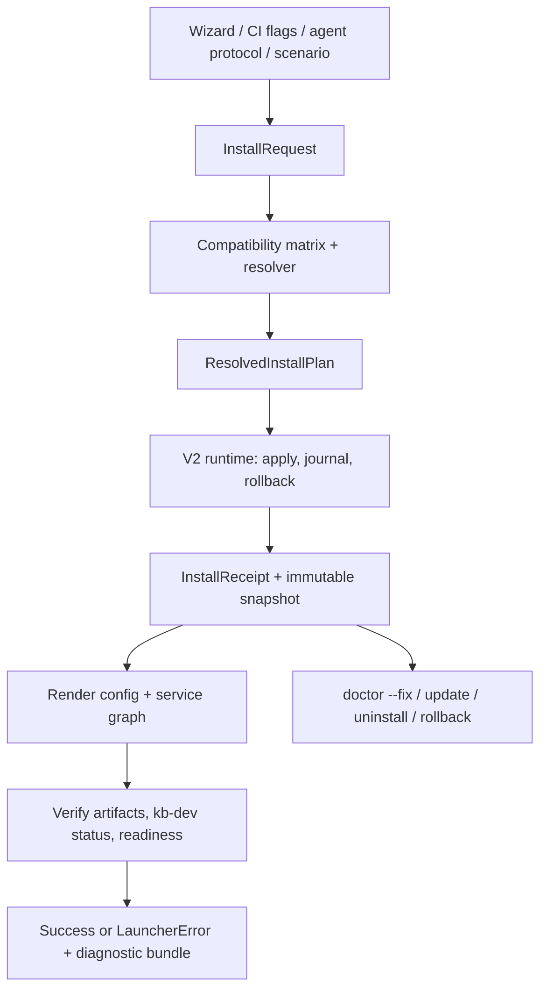

# kb-create V2 — launcher contract reset

**Status:** active public implementation
**Scope:** V2 packages remain under `tools/kb-create/v2/` to keep their import
boundary explicit. The released root binary is `kb-create` and imports only
this V2 command surface; V2 does not import legacy launcher state, manifests,
package manager or execution engine.

## Implemented vertical slice

The V2 boundary is executable and covered by an offline journey test:

- `catalog/` is the deliberately small immutable release index used before
  installation. It resolves the platform bundle, declared compatibility and
  capability providers without scanning an installation.
- `resolve/` emits the immutable `ResolvedInstallPlan` and fails on missing or
  ambiguous providers instead of selecting one by iteration order.
- `render/` projects that plan into `kb.config.jsonc` and `devservices.yaml`,
  with V2-owned validation and atomic writes.
- `verify/` enforces `resolved graph == devservices == kb-dev status` through
  a status adapter, equally usable in a real run and an offline journey.
- `artifacts/`, `runtime/`, `receipt/`, `doctor/` and `diagnostics/` establish
  exact artifact application, recovery, manifest-gap
  reporting and redacted dossiers before CLI cutover exposes the flow.
- `cmd/kb-create-v2/` is the root binary's machine frontend: `plan`,
  `apply`, `update`, `uninstall`, explicit `rollback`, and manifest-aware
  `doctor` all use V2 contracts and emit one JSON envelope.

There is no legacy `install` fallback. Connecting two resolvers or lifecycle
owners to one production command would recreate the split-brain V2 removes.

`apply` and `update` require an immutable release index and request. Recovery
operations deliberately require only `--platform-root` (and a snapshot for
rollback), so they recover the verified V2 receipt rather than recalculating a
new plan. Raw package-manager transcript is private under `.kb/logs/`; failed
operations add a redacted dossier under `.kb/diagnostics/`.

CI and agents may pass the request file unchanged, or use direct flags such
as `--request-platform-root`, `--platform-version`/`--platform-channel`,
`--sdk-version`, `--plugins id@version,...`, `--adapters id@version,...`,
`--service-profile`, `--policy`, and `--offline`. Both forms normalize into
the same `InstallRequest` before resolution; flags never build a separate
shell-level install sequence.

For a human, `kb-create wizard --index release-index.json
--request-platform-root /path/to/platform` asks only for product axes and
returns the same JSON request on stdout. It does not apply anything or own a
second resolver; feed that request into `plan` or `apply` to continue.

## Scenarios

`scenario/` is the reusable journey layer. A V2 scenario declares only
product axes (profile/plugins/adapters), validated fields, and either a
manifest requirement ID or a provider capability. It has no shell actions,
package specs, arbitrary file writes, or `devservices.yaml` patches.

Use `--scenario <id> --scenario-answers '{"field":"value"}'` with direct
request flags. The scenario compiles into the same `InstallRequest`; resolver
accepts each value only when the selected platform/plugin/adapter manifest
declares that requirement and JSON Pointer. Secret fields become secret-store
references and cannot have a scenario default. The migrated built-ins are
`commit`, `custom`, `explore`, `plugin-author`, and `release`.

Release automation creates the index with `kb-create-release-index --input
manifest-export.json --manifest-root staging-root --output release-index.json`.
The command reads the exact V2 manifests staged with each artifact and replaces
any hand-authored config projection; missing/mismatched manifests fail the
release. It then rejects an index whose channel points outside its platform
set and seals the canonical payload with a digest. `kb-create` verifies that
digest before resolving.

Secret input uses `--secret-env requirement.id=ENV_VAR`, so CI/agents pass a
reference to process environment rather than secret text through argv/JSON.
V2 stores the value only in `.kb/v2/secrets.env` (0600); generated config,
receipt, scenario state, logs, diagnostics and telemetry retain only the
manifest requirement or `${ENV_VAR}` placeholder. `kb-dev` reads this private
store when it expands the rendered service environment.

`kb-dev` resolves `${ENV_VAR}` by the *variable name*, so when the plan binds a
requirement to an environment variable the value is stored under both the
requirement ID (what the launcher verifies and doctor checks) and that variable
name. Two secrets bound to one variable must carry the same value or the run
fails instead of letting the last write win.

Scenario field rules that matter to authors:

- A field whose `when` is false is neither required nor emitted, whatever an
  earlier answer left in the state.
- An optional free-text field left blank means "not provided": it is not
  validated and is not emitted, so it never overwrites a component's own
  default with an empty string.
- Validators are `nonEmpty` and `pattern` (Go RE2 in `arg`); an unknown
  validator or an invalid pattern fails when the scenario is loaded.

The platform bundle can also declare an OS/architecture-specific `kb-dev`
binary asset. V2 verifies its SHA-256 and installs it in `.kb/v2/bin`; a CLI
`--kb-dev` is an explicit development override, not a release dependency.

## Why V2

The launcher owns one declarative action engine, catalog, journal, recovery
primitives, wizard, agent protocol and direct CI flow. Installation state is
resolved from the sealed release index and request before any filesystem or
package-manager mutation.

V2 makes one promise: a user, CI job and agent ask for the same installation;
the launcher resolves the same compatible artifacts, applies the same action
DAG, renders the same service graph, and either verifies it or fails with an
actionable recovery path.

## Non-goals

- Do not import or wrap `internal/engine`, legacy manifests, legacy receipts or
  legacy package-manager code. V2 owns application, recovery and artifact
  boundaries directly.
- Do not retain two production install semantics after cutover. Existing
  launcher code is a migration input and temporary compatibility boundary,
  not a permanent second source of truth.
- Do not make network E2E the primary correctness proof. Most V2 coverage
  runs against deterministic offline artifact fixtures; real npm is reserved
  for candidate smoke.

## Target architecture



### One ownership rule

`ResolvedInstallPlan` owns requested platform/SDK/plugins/adapters, exact
artifact versions, config patches, provider bindings, binaries and the
expected service graph.
`devservices.yaml` and generated runtime configuration are rendered outputs.
A package scan validates declared artifacts; it must never decide which
services the user received merely because a transitive dependency exposes a
manifest.

The required post-condition is:

```text
resolved expected services == rendered devservices services == kb-dev status services
```

For the current product horizon, core and official services are one platform
bundle. A selected platform version owns their exact packages, default
profiles and service graph. Services are therefore not independently resolved
versions. An explicit, platform-bundle companion set is the only permitted
exception to a direct user selection.

## Public operation model

All transports compile to the same request and invoke the same operations:

```text
plan → apply → status → verify
update → snapshot → apply → verify | rollback
uninstall → plan → apply → verify
doctor --fix → recovery plan → apply → verify
```

`InstallRequest` supports the same first-class axes everywhere:

- platform exact version or channel: `stable`, `canary`, `experimental`;
- SDK exact version or channel, constrained by the selected platform;
- platform-owned service profile, plugins, independently versioned adapters
  and explicit provider preferences;
- explicit project/platform roots;
- artifact source: online registry or offline fixture;
- scenario ID for a reusable user journey.

Wizard selects valid options from the resolver. CI and agents can submit the
request directly in flags or JSON. Neither may reconstruct a shell sequence.

## Compatibility matrix and resolver

The matrix is evaluated before every network or filesystem side effect. It
answers which combinations of platform/SDK/channel/plugins/adapters/binaries
are valid and yields exact artifacts plus the platform-owned service dependency
graph.
Core and official services ship with the selected platform release; a missing
or inconsistent service manifest is a platform candidate defect, not a
user-resolvable version choice. Invalid requests fail fast with the same error
contract as runtime failures.

Plugins and adapters remain independently versioned. Their manifests
progressively declare supported platform and SDK ranges. Adapters additionally
declare provided capabilities; plugins/services declare required capabilities.
The resolver selects exactly one compatible provider per required capability,
honours explicit provider preferences, and rejects a missing or ambiguous
binding before installation. It may select an unpinned compatible plugin or
adapter version, but it never silently changes an explicit pin:

| Policy | Behaviour |
|---|---|
| `strict` (default for CI/agents) | Exact pins must be compatible or resolution fails. |
| `compatible` (wizard default) | Resolver may choose only unpinned compatible versions and displays the resolved set before apply. |
| `upgrade-safe` (explicit update only) | Resolver may advance unpinned artifacts within the defined compatibility policy; a snapshot is mandatory. |

No intersecting range produces `KB_CREATE_INCOMPATIBLE_COMPONENTS` before
download or config writes. A missing capability produces
`KB_CREATE_PROVIDER_UNRESOLVED`; a competing explicit binding produces
`KB_CREATE_PROVIDER_AMBIGUOUS`. Each error names the selected versions or
providers, the manifest constraint that rejected them and safe alternatives.
A plugin or adapter without a range is `unknown compatibility`, never silently
universal: it needs explicit user policy during migration and becomes a
publish-time failure for official artifacts after the migration window.

The resolver also validates graph completeness before `apply`: required
providers, ports, dependency targets, offline artifacts and mandatory service
metadata must all resolve. No command may claim success with an incomplete
default configuration.

The technical source of truth for configuration variables and service metadata
remains the manifests shipped by platform components, plugins and adapters.
V2 does not turn the wizard into a universal manifest-variable form. The
wizard chooses product-level axes and profiles; after verified artifacts are
available, manifest-derived required input either receives a safe default or
returns structured `KB_CREATE_INPUT_REQUIRED` with a human hint and machine
schema. CI/agents supply those values in `InstallRequest` and resume the same
receipt/journal without recomputing a different flow.

### Doctor is manifest-aware configuration diagnosis

`doctor` loads the active receipt, resolves the installed package manifests
for every selected platform component, plugin and adapter, and compares their
declared requirements with the effective generated configuration. It reports
missing values, invalid values, unresolved capabilities and stale bindings as
structured findings — never by treating an absent default as a later runtime
failure.

For each finding it records the manifest owner, config path/key, whether the
value is secret, expected schema/constraint, safe current-state summary and a
recovery action. Secret values are never printed, bundled or sent through
telemetry; the only permitted state is `set`, `missing` or `invalid`.

```text
KB_CREATE_CONFIG_REQUIRED
Owner: @kb-labs/plugin-x@4.1.0
Requirement: adapters.llm.apiKey (secret)
Current state: missing
Hint: kb-create doctor --fix --input adapters.llm.apiKey
```

`doctor --fix` must not invent a secret or silently choose between competing
providers. It may render safe manifest defaults, restore a receipt/snapshot,
rebuild derived config and ask a human/agent for required input through the
same `InstallRequest` schema. The subsequent engine run verifies the repaired
configuration, service graph and readiness before updating the receipt.

### Packages declare their own configuration requirements

A selected package states the configuration it needs in a
`kb-create.requirements.json` shipped in its tarball (package root or `dist/`):

```json
{
  "schema": "kb.create.requirements/v1",
  "requirements": [
    { "id": "gateway.access.mode", "path": "/gateway/access/mode", "default": "secured" },
    { "id": "gateway.jwtSecret", "secret": true, "env": "GATEWAY_JWT_SECRET", "services": ["gateway"] }
  ]
}
```

`prepare-release-index.mjs` merges these into the package's staged
`kb-create.manifest.json`, and `kb-create-release-index` seals them into the
index; the sealed shape is unchanged (`id`, `path`, `default`, `secret`, `env`,
`services`), so launchers that predate this file keep verifying the digest.

- The file is deliberately **not** named `kb-create.manifest.json`: that name is
  treated as a package's *primary* manifest and would hide a service's
  `kb.service/1` graph, dropping the service from the index.
- `default` is a plain JSON value here (`"secured"`, not `"\"secured\""`).
- A malformed file, a missing/duplicate `id`, or a secret without `env` and
  `services` fails the release rather than shipping the package without its
  requirements.
- Requirements are unconditional. "Only when secured" is expressed by the
  scenario (`when` + a field bound to the requirement); the index carries no
  conditional-requirement syntax.

The gateway declares `gateway.access.mode` (`local` | `secured`), the optional
first-admin identity (`gateway.bootstrap.adminEmail`, `gateway.bootstrap.tenantId`) and the
secrets `gateway.bootstrap.password` and `gateway.jwtSecret`. Non-interactive
secured install:

```bash
export ADMIN_PASSWORD=... JWT_SECRET="$(openssl rand -hex 64)"
kb-create --operation apply --index release-index.json --input request.json \
  --secret-env gateway.bootstrap.password=ADMIN_PASSWORD,gateway.jwtSecret=JWT_SECRET
# request.json: values {"gateway.access.mode":"\"secured\"","gateway.bootstrap.adminEmail":"\"admin@example.com\""}
#               secretInputs ["gateway.bootstrap.password","gateway.jwtSecret"]
```

The interactive wizard asks for the admin email but not for secrets (it does not
yet persist secret input). A secured install made that way has no admin until
`kb auth reset-admin` is run; `kb-dev doctor` reports exactly that.

## Engine, receipt and snapshots

The V2 runtime receives the resolved action DAG and is responsible for
variables, step-level errors, retry policy, journal, lock and rollback.

After a verified apply, V2 writes an immutable receipt containing:

- normalized request and resolved artifacts (including hashes);
- expected service graph and hashes of generated configuration;
- engine journal/correlation ID and verification evidence;
- snapshot parent/ID and active channel/version axes.

Before update or uninstall, V2 creates a snapshot of receipt, generated
configuration, service graph, managed locks and resolved artifacts. Failed
verification restores that snapshot; `rollback --to <snapshot>` is explicit
and uses the same engine/recovery model.

## Errors, logs and diagnostics

Every operation uses one redacted `LauncherError` contract:

```text
code, stage(resolve|apply|verify|recover), retryable,
message, safe cause, hint, correlation ID, safe details
```

The error is rendered for humans, returned through `--json` and agent
protocol, persisted in the journal/receipt, and consumed by `doctor --fix`.

Each invocation writes a full local log. A failure additionally writes a
redacted dossier under `.kb/diagnostics/<correlation-id>/` with resolved plan,
receipt/snapshot metadata, engine journal, package-manager output, toolchain,
config hashes, service graph and `kb-dev status`. The CLI prints one recovery
command and the bundle path so users can attach it to an issue without manual
terminal reconstruction.

## Opt-in anonymous telemetry

With explicit consent only, V2 emits a small, non-blocking anonymous outcome
event: operation, stage, error code, duration, OS/architecture, selected
component count and channel. It never sends paths, repository/project names,
environment values, package-manager output, logs, tokens or the diagnostic
bundle. Offline/no-consent operation is behaviorally identical and telemetry
failure never changes the installation result.

## Test strategy: shard by contract and resources

| Shard | Source | Assertion | Network |
|---|---|---|---|
| `resolver-contract` | matrix + fixture catalog | request resolves/rejects with an explicit reason and exact graph | none |
| `config-contract` | resolved plan | graph renders valid config, no unexpected/missing service, ports/dependencies valid | none |
| `engine-recovery` | fake package/binary adapters | journal, partial failure, retry, rollback and doctor recovery | none |
| `doctor-manifest-contract` | manifests + effective-config fixtures | required/default/secret fields, provider bindings and repair-plan generation | none |
| `launcher-journey` | offline tarball/binary fixtures | fresh, explicit, rerun, update, uninstall and rollback | none |
| `service-profile` | isolated fixture per profile | `kb-dev status` equals receipt graph; required services meet readiness | fixture/local |
| `release-smoke` | exact npm canary + released binaries | default fresh install and required runtime contract | real npm only |

Each shard owns a distinct HOME, platform/project roots, port allocation and
artifact namespace. Shards are never organised by test filename; they are
organised by the mutable resources and contract they own.

## Cutover gates

V2 may replace the launcher only when all are true:

1. Default fresh install, explicit CI request, scenario/wizard and agent use
   the same resolved request/engine path.
2. `create`, `update`, `uninstall`, manifest-aware `doctor --fix` and rollback
   operate on receipts/snapshots, not legacy per-command state.
3. Default and every supported service profile pass the graph/config/status
   contract; required defaults pass readiness.
4. Offline matrix is deterministic; post-publish smoke passes the exact
   candidate artifacts.
5. Every failure emits a redacted diagnostic bundle and actionable error.

## Delivery sequence

1. Define V2 contracts and fixture catalog: request, matrix, resolved plan,
   receipt, snapshot and `LauncherError` schemas.
2. Complete the V2 runtime's resolved-plan application, journal and receipt
   events; it owns execution semantics rather than adapting old state.
3. Implement config/service graph renderer and verifier, then make offline
   config-contract tests authoritative.
4. Implement V2 fresh/default and explicit CI path, followed by wizard and
   agent adapters.
5. Add update/uninstall/doctor/rollback over snapshots and recovery plans.
6. Add redacted dossiers and consent-gated telemetry.
7. Run the full matrix and make V2 the only production path in a deliberate
   breaking cutover, consistent with ADR-0035.

## Existing decisions this completes

- `docs/adr/0028-human-and-agent-frontends-share-the-engine.md`
- `docs/adr/0031-deterministic-install-plans-and-recovery.md`
- `docs/adr/0035-breaking-cutover-for-the-new-installer-contract.md`
